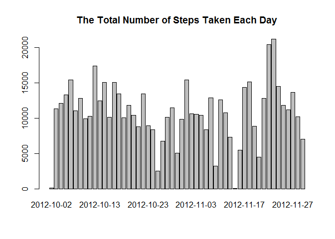
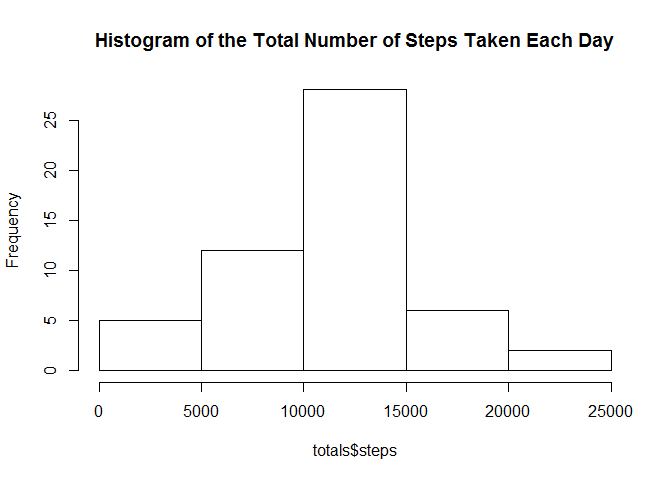
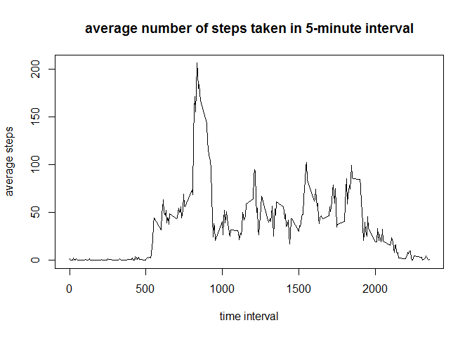
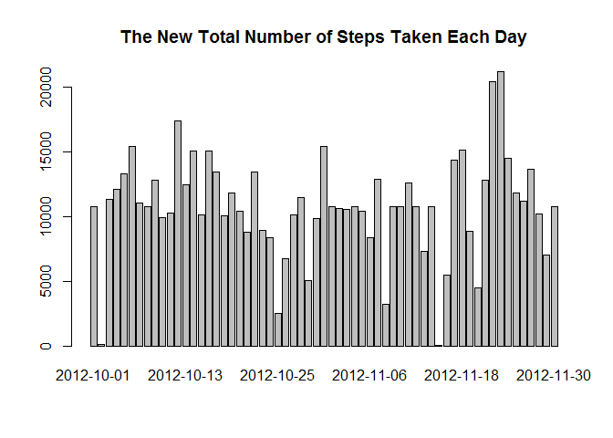
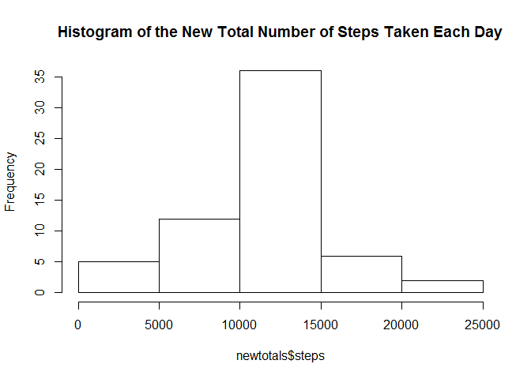
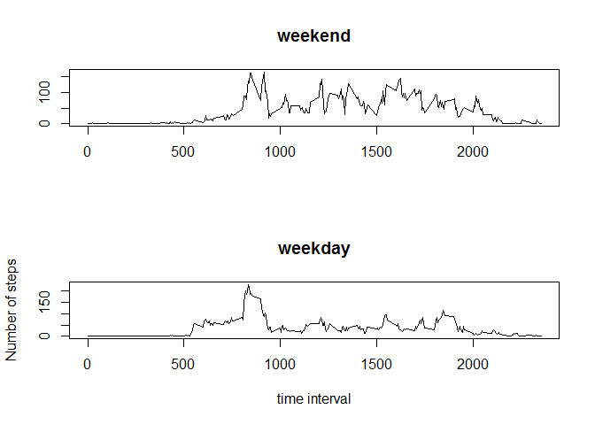

# Reproducible Research: Peer Assessment 1


## 1.Loading and preprocessing the data

```r
setwd("D:\\My Documents\\GitHub\\RepData_PeerAssessment1")
activity <- read.csv("data/activity.csv")
```
First, let's look at the summary of the data, and transform the date as Date variables.

```r
summary(activity)
```

```
##      steps                date          interval     
##  Min.   :  0.00   2012-10-01:  288   Min.   :   0.0  
##  1st Qu.:  0.00   2012-10-02:  288   1st Qu.: 588.8  
##  Median :  0.00   2012-10-03:  288   Median :1177.5  
##  Mean   : 37.38   2012-10-04:  288   Mean   :1177.5  
##  3rd Qu.: 12.00   2012-10-05:  288   3rd Qu.:1766.2  
##  Max.   :806.00   2012-10-06:  288   Max.   :2355.0  
##  NA's   :2304     (Other)   :15840
```

```r
activity$date <- as.Date(activity$date)
```

## 2.What is mean total number of steps taken per day?
We'll use aggregate() to calculate the total number of steps taken each day.

Next, a barplot and histogram is as follows.

To see the mean and median total number of steps taken per day, summary() is a good choice.

```r
totals <- aggregate(steps ~ date, data=activity, sum)
barplot(totals$steps,names.arg=totals$date,main="The Total Number of Steps Taken Each Day")
```

 

```r
hist(totals$steps,main="Histogram of the Total Number of Steps Taken Each Day")
```

 

```r
summary(totals$steps)
```

```
##    Min. 1st Qu.  Median    Mean 3rd Qu.    Max. 
##      41    8841   10760   10770   13290   21190
```

## 3.What is the average daily activity pattern?
Similarly, We can use aggregate() to calculate the average number of steps each interval.

Then, we'll make a scatter plot.

To see which interval has the maximum number of steps

```r
aves <- aggregate(steps ~ interval, data=activity, mean)
plot(aves$interval,aves$steps,type="l",main="average number of steps taken in 5-minute interval",xlab="time interval",ylab="average steps")
```

 

Next, let's see which interval has the maximum number of steps

```r
aves[aves$steps==max(aves$steps),]
```

```
##     interval    steps
## 104      835 206.1698
```
## 4.Imputing missing values
To impute missing values, we can do as follows:

-For each thing, make some kind of aggregate calculation

-Merge the aggregate number back into the original data as a new imputation column based on a link between individual thing instances and the aggregate thing instance

-Where the original is N/A replace with the equivalent entry from the imputation column

-Get rid of the imputation column to tidy up.

```r
summary(activity$steps)["NA's"]
```

```
## NA's 
## 2304
```

```r
merged <- merge(activity,aves,by.x="interval",by.y="interval")
head(merged)
```

```
##   interval steps.x       date  steps.y
## 1        0      NA 2012-10-01 1.716981
## 2        0       0 2012-11-23 1.716981
## 3        0       0 2012-10-28 1.716981
## 4        0       0 2012-11-06 1.716981
## 5        0       0 2012-11-24 1.716981
## 6        0       0 2012-11-15 1.716981
```

```r
merged$steps.x[is.na(merged$steps.x)]<-merged$steps.y[is.na(merged$steps.x)]
head(merged)
```

```
##   interval  steps.x       date  steps.y
## 1        0 1.716981 2012-10-01 1.716981
## 2        0 0.000000 2012-11-23 1.716981
## 3        0 0.000000 2012-10-28 1.716981
## 4        0 0.000000 2012-11-06 1.716981
## 5        0 0.000000 2012-11-24 1.716981
## 6        0 0.000000 2012-11-15 1.716981
```

```r
merged<-merged[,1:3]
names(merged)<-c("interval","steps","date")
head(merged)
```

```
##   interval    steps       date
## 1        0 1.716981 2012-10-01
## 2        0 0.000000 2012-11-23
## 3        0 0.000000 2012-10-28
## 4        0 0.000000 2012-11-06
## 5        0 0.000000 2012-11-24
## 6        0 0.000000 2012-11-15
```

Next, we'll use merged data, to do the same work as part one.

We can see there a difference between them.

```r
newtotals <- aggregate(steps ~ date, data=merged, sum)
barplot(newtotals$steps,names.arg=newtotals$date,main="The New Total Number of Steps Taken Each Day")
```

 

```r
hist(newtotals$steps,main="Histogram of the New Total Number of Steps Taken Each Day")
```

 

```r
summary(newtotals$steps)
```

```
##    Min. 1st Qu.  Median    Mean 3rd Qu.    Max. 
##      41    9819   10770   10770   12810   21190
```
## 5.Are there differences in activity patterns between weekdays and weekends?
First, let's transform date to weekday, we'll use weekdays() and is.element() here.

```r
merged$weekday <- weekdays(merged$date)
head(merged)
```

```
##   interval    steps       date weekday
## 1        0 1.716981 2012-10-01  星期一
## 2        0 0.000000 2012-11-23  星期五
## 3        0 0.000000 2012-10-28  星期日
## 4        0 0.000000 2012-11-06  星期二
## 5        0 0.000000 2012-11-24  星期六
## 6        0 0.000000 2012-11-15  星期四
```

```r
merged$weekday <- is.element(merged$weekday,c("星期一","星期二","星期三","星期四","星期五"))
head(merged)
```

```
##   interval    steps       date weekday
## 1        0 1.716981 2012-10-01    TRUE
## 2        0 0.000000 2012-11-23    TRUE
## 3        0 0.000000 2012-10-28   FALSE
## 4        0 0.000000 2012-11-06    TRUE
## 5        0 0.000000 2012-11-24   FALSE
## 6        0 0.000000 2012-11-15    TRUE
```

```r
newaves <- aggregate(steps ~ interval+weekday, data=merged, mean)
```

Next, to make a plot.

```r
par(mfrow = c(2, 1))
plot(newaves[!newaves$weekday,]$interval,newaves[!newaves$weekday,]$steps,type="l",main="weekend",xlab="",ylab="")
plot(newaves[newaves$weekday,]$interval,newaves[newaves$weekday,]$steps,type="l",main="weekday",xlab="time interval",ylab="Number of steps")
```

 
